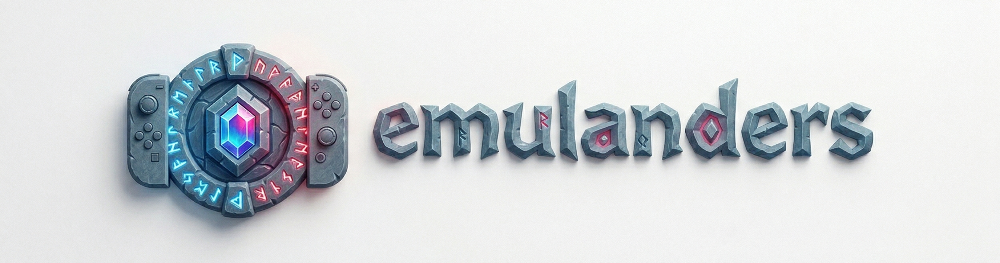

  

  <strong>Emulanders: Skylanders NFC (Mifare) Emulation for Nintendo Switch</strong>

  
  
  

## ⚠️ Disclaimer

**This project is a clean-room reverse engineering effort for educational and archival purposes.**
Emulanders does **not** distribute copyrighted material, encryption keys, Nintendo SDK code, or Skylander game data. Users are expected to provide their own backups (`.dump` or `.bin` files) extracted from physical hardware they legally own.

---

## 📖 Overview

Emulanders is a background sysmodule and Tesla Overlay for the Atmosphère CFW. It enables the loading and hot-swapping of Skylander figures directly from your SD card within *Skylanders: Imaginators*.

Development status and future objectives are documented in the [Project Roadmap](ROADMAP.md).

### Technical Foundation
Standard Nintendo Amiibos utilize NTAG formats via the `nfp` (Nintendo Figurine Platform) service. In contrast, Skylanders hardware relies on NXP Mifare Classic 1K tags. *Skylanders: Imaginators* bypasses the standard Amiibo stack and communicates directly with the low-level **`nfc:mf:u`** (Mifare User) IPC service.

Emulanders acts as a protocol bridge for the `nfc:mf:u` interface, providing a virtualized data path. It intercepts IPC requests and serves figure data from the SD card, ensuring compatibility with the game's official communication standards.

---

## 📥 Download

The latest stable binaries, including the sysmodule (`exefs.nsp`) and the Tesla overlay (`emulanders.ovl`), can be found on the **[Releases Page](https://github.com/joaohypo/emulanders/releases/latest)**. 

Always ensure you are using the version compatible with your current Atmosphère and Firmware setup.

---

## 🚀 Core Features

- **Mifare Protocol Emulation:** Comprehensive implementation of the `nfc:mf:u` service stack.
- **Hot-swapping:** Change active figures via the Tesla Overlay during gameplay.
- **Figure Identification:** Support for `.png` preview images within the menu.
- **State Persistence:** Retains emulation state and selected figures across reboots.
- **Tool Compatibility:** Operates in parallel with Amiibo emulators (e.g., Emuiibo) without service conflict.
- **Resource Efficiency:** Low-overhead background processing and on-demand asset loading.

---

## ✅ Compatibility

- **Target Game:** Skylanders: Imaginators (Nintendo Switch Version).
- **Firmware Support:** Theoretically compatible with Firmware **4.0.0** and higher (due to `nfc:mf:u` requirements).
- **Validated Environment:** Extensively developed and tested on **Firmware 21.2.0** and **Atmosphère 11.1.1**.

---

## 📂 Installation

### Quick Start (Recommended)
To install Emulanders, simply **extract the release archive and drag all folders** (`atmosphere`, `switch`, `emulanders`) to the root of your Switch's SD card.

### Manual File Placement
Alternatively, you can place the files manually:
- **Sysmodule**: `sd:/atmosphere/contents/420000000000E311/exefs.nsp`
- **Tesla Overlay**: `sd:/switch/.overlays/emulanders.ovl`

### SD Card Structure
The project utilizes the `sdmc:/emulanders/` directory.

1. **`/figures/`**: Place raw `.dump` or `.bin` backups here. Subfolders are supported and recommended for organization (e.g., by Element or Series).
   *Example:* `sd:/emulanders/figures/Senseis/King_Pen.dump`
2. **`/overlay/lang/`**: Language definition files (JSON).
3. **`/flags/`**: System-managed files for state persistence.

---

## 🎮 Usage

  <a href="https://youtu.be/oYJi1xWd5xI">
    
     
    <em>Watch the Usage Demonstration on YouTube</em>
  </a>

1. Open the Tesla menu (**L + D-Pad Down + Right Stick Click**).
2. Select **emulanders**.
3. Set **Emulation** to **ON**.
4. Navigate to **View Figures Folder** and select a file (`.dump` or `.bin`).
5. The `>> ACTIVE` indicator confirms the figure is mounted.
6. **To swap:** Select a different file.
7. **To unmount:** Select the active file again, use the **Clear active Skylander** menu option, or press the **X** button while the overlay is open.

### Technical Notes
- **Polling Overhead:** To reduce CPU usage after a character has loaded, it is recommended to unmount the figure. This suspends the high-frequency IPC polling.
- **Visual Assets:** Portraits are displayed if a `.png` file with the identical filename exists in the same directory as the figure backup. (Target resolution: ~150x200px).
- **Swap Force:** *Skylanders: Imaginators* on Switch provides full compatibility for Swap Force figures. However, because the game itself does not implement the "part-mixing" mechanic on this platform, you only need to select a single backup file (either the base or the top half) to load the character in its entirety.

---

## 🤝 Coexistence
Emulanders and Emuiibo target different logical interfaces (`nfc:mf:u` and `nfp`, respectively). They can be installed and used simultaneously without service-level conflicts.

---

## 🐛 Debugging
If a specific dump fails to load:
1. Open the overlay and enter the **Logs Manager**.
2. Enable **Debug Logging**.
3. Reproduce the error in-game.
4. Select **Extract to SD** to save the buffer to `sdmc:/emulanders/debug_log_dump.txt`.
5. Attach the log when opening an issue.

---

## 🛠️ Compilation
Requires the [Switch Rust Toolchain](https://github.com/aarch64-switch-rs/setup-guide) and devkitPro (devkitA64).
Run `make dist` for release builds or `make dist-dev` for debug builds.

---

## ❤️ Credits & Acknowledgments

**The primary credit for this project belongs to XorTroll and the incredible contributors of the Emuiibo project.**
Emulanders is built upon the foundational research, sysmodule architecture, and UI logic originally developed for Emuiibo. While this software has been fully refactored to specialize in the `nfc:mf:u` service for Skylanders, its existence is a direct result of the brilliant work and open-source spirit of XorTroll and everyone who collaborated on the original Amiibo emulation system.

Special thanks to:
- [**XorTroll**](https://github.com/XorTroll): For the original Emuiibo project, sysmodule framework, and continuous inspiration to the Switch homebrew scene.
- **Emuiibo Contributors**: *Subv, ogniK, averne, spx01, SciresM* and everyone involved in the original **nfp-mitm** research.
- **Overlay Devs**: *AD2076* and *AmonRaNet* for their essential work on the Tesla overlay framework.
- [**Switchbrew**](https://switchbrew.org/): For the peerless technical documentation that makes all Switch homebrew possible.
- [**nx (aarch64-switch-rs)**](https://github.com/aarch64-switch-rs/nx): For the native Rust bindings.
- [**SkylandersNFC**](https://github.com/skylandersNFC): For the deep-dive research into Mifare figure structures.

Finally, a massive thank you to the **Skylanders community** for their tireless passion in building tools, creating tutorials, and keeping the magic of the game alive for future generations.

---

## 📜 License

Emulanders is licensed under **GNU GPLv3**. 

By adopting **GPLv3**, we ensure that the project remains open and protected against "Tivoization" (blocking users from running modified versions on their hardware) and provides stronger patent protections. This is the State-of-the-Art standard for preserving freedom in modern console homebrew. 

See the [**LICENSE**](LICENSE) file for full details.

*Ryujinx project exemption: The Ryujinx team is exempt from GPLv3 licensing for this codebase.*